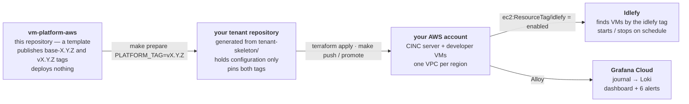

<p align="center">
  
</p>

# vm-platform-aws

Hardened developer VMs on AWS — Terraform + CINC, built to be managed by [Idlefy](https://idlefy.com).

[](https://github.com/idlefy/vm-platform-aws/actions/workflows/ci.yml)
[](https://idlefy.github.io/vm-platform-aws/)
[](LICENSE)
[](https://github.com/idlefy/vm-platform-aws/tags)

A developer gets an EC2 instance that is hardened on first boot and kept that way by a configuration run every 30 minutes; the team gets one file that says who has a VM where, an audit trail that outlives the machine, and a fleet that Idlefy switches off when nobody is using it.

## How it fits together



This repository deploys nothing. It publishes a CINC cookbook (`cinc/cookbooks/base/`) as `base-X.Y.Z` tags and two Terraform modules plus a tenant skeleton (`vms/modules/`, `tenant-skeleton/`) as `vX.Y.Z` tags. A **tenant** is a private repository generated from the skeleton; it pins both and holds the values that are yours — regions, VMs, SSH keys, the CINC server, the Grafana stack.

## Get started

```bash
git clone https://github.com/idlefy/vm-platform-aws.git
cd vm-platform-aws
claude
```

The `get-started` skill checks your tools, asks where the tenant repository should live, and creates it from `tenant-skeleton/`. The `tenant-setup` skill takes over inside the new repository — open it with `claude` there; it collects the values, resolves the pin, and stops before anything is applied.

Without Claude Code:

1. Create a private repository and copy the **contents** of `tenant-skeleton/` into its root — the `Makefile` has to land at the top level (`cp -r vm-platform-aws/tenant-skeleton/. <your-tenant>/`).
2. `make prepare PLATFORM_TAG=vX.Y.Z` — materialises the config files and pins the modules to that release. The current tag is the one on the release badge above, or `git tag --list 'v*' --sort=-v:refname | head -1`.
3. Fill in the six tenant files the command lists (`vms/tenant.auto.tfvars`, `vms/backend.hcl`, `infra/tenant.auto.tfvars`, `infra/backend.hcl`, `infra/ansible/group_vars/all/tenant.yml`, `cinc/.chef/knife.rb`), then edit the four remaining `REPLACE_ME` attributes in `cinc/policyfiles/dev-vm.rb` — the two `loki` ones and the two `traefik` ones — and only then `make bump-cookbook TAG=base-X.Y.Z`, which locks the tag and the attributes together. In the other order, `make push` refuses: the lock would not match the policyfile. `./scripts/placeholder-check.sh --all` tells you what is left; nothing catches the Traefik pair at converge.
4. Create `infra/ansible/group_vars/all/vault.yml` from its `.example` and a `~/.vault_pass` to open it; the Ansible step needs both.
5. `cd vms && terraform init -backend-config=backend.hcl && terraform plan`.

The [runbook](https://idlefy.github.io/vm-platform-aws/runbook/) takes it from there: state bucket, CINC server, first VMs, the Loki token.

## What a VM gets

| Control | How | Design record |
|---|---|---|
| Firewall | iptables, default-drop inbound; IMDS (`169.254.169.254`) reachable only by `root` and the Instance Connect uid | |
| SSH | `ubuntu` with a static key and `sudo` on exactly one command; `admin` via EC2 Instance Connect with 60-second keys; root login off; fail2ban | |
| Sudo audit | every verdict reaches Loki on a path that bypasses the collector's rate limiter, so a developer cannot bury their own escalation under their own log flood; Falco is the authoritative detector | [sudo-audit-alerting](docs/design/sudo-audit-alerting.md) |
| Runtime detection | Falco with a small measured ruleset — four rules: `AWS credentials file written under a home directory`, `Instance metadata service contacted by a non-root process`, `Denied access to the VM credential store`, `Developer user invoked sudo` | [sudo-audit-alerting](docs/design/sudo-audit-alerting.md) |
| AWS credentials | one IAM identity role per VM with a permissions boundary derived from its access bundles; a root-owned broker publishes short-lived STS credentials to tmpfs (`0750` directory, `0640` file, both `root:ubuntu`) and re-verifies the directory every run | [per-vm-aws-access](docs/design/per-vm-aws-access.md) |
| Docker | rootless; container root maps to the `ubuntu` uid; IMDSv2 hop limit 1 | |
| Updates | `unattended-upgrades` daily across every configured apt repo; Alloy and Falco are version-pinned and blacklisted from it, so they move only by a deliberate edit | |
| Drift | `cinc-client` re-converges every 30 minutes; manual changes do not survive | |
| Audit trail | systemd journal → Grafana Alloy → Grafana Cloud Loki within seconds; `ubuntu` can neither read the system journal nor stop the shipper; a checked-in dashboard and six Grafana alert rules read the stream | [log-shipping](docs/design/log-shipping.md), [optional-log-shipping](docs/design/optional-log-shipping.md) |
| Publishing | Traefik on every VM: a container labelled with a `Host` rule gets a Let's Encrypt certificate and basic auth, without the developer touching a config the cookbook manages | |
| Tailnet | Tailscale, joined under the developer's own identity by the one `sudo` command they hold | |
| Dev tooling | Node.js, kubectl, helm, werf, gh, uv, yq, ripgrep, zsh, Claude Code CLI; NVIDIA Container Toolkit on GPU instance types | |

The recipe-by-recipe reference is [`cinc/README.md`](cinc/README.md); the module and region model is [`vms/README.md`](vms/README.md); the dashboard and alerts are [`grafana/README.md`](grafana/README.md).

## Idlefy

Every instance is tagged `idlefy = "enabled"` (the `idlefy_managed` variable, default `true`). The tag is a label — this platform grants Idlefy nothing. Idlefy's own IAM role carries the boundary: its start/stop/reboot permissions are conditioned on `ec2:ResourceTag/idlefy = enabled`, so a VM without the tag is invisible to it, and a VM with it is stopped when the developer's lease ends and started when they ask for it.

- **Connect your account** at [idlefy.com](https://idlefy.com); the onboarding there creates the role Idlefy assumes into your account.
- **Opt one VM out** with `tags = { idlefy = "disabled" }` on its entry in `instances.auto.tfvars`.
- **Opt the fleet out** with `idlefy_managed = false` in `vms/tenant.auto.tfvars`.

## Versioning

Two tag streams: `base-X.Y.Z` publishes the cookbook and `vX.Y.Z` publishes the modules and the skeleton. A tenant pins the cookbook by tag in its Policyfile and the modules by the commit SHA the tag resolves to; `make pin-check` in the tenant refuses to promote a pin whose tag has moved. Details, including why the two pins are shaped differently: [versioning](https://idlefy.github.io/vm-platform-aws/versioning/).

## Verify your edits

```bash
make boundary-check                                    # modules stay inside themselves
( cd vms/modules/ec2          && terraform test )      # 26 runs
( cd vms/modules/fleet-guards && terraform test )      # 5 runs
make smoke                                             # the skeleton against this tree
for t in test/test-release-gate.sh test/test-resolve-pin.sh test/test-boundary-check.sh \
         test/test-placeholder-check.sh test/test-prepare.sh test/test-pin-to-worktree.sh \
         test/test-preflight.sh test/test-skeleton-sync.sh test/test-get-started-skill.sh; do "$t"; done
( cd cinc && make lint && make test && make test-broker && make test-loki-token )
make test-pin-check                                    # root target; needs chef
mkdocs build --strict
```

`terraform test` needs Terraform ≥1.7 for `mock_provider` (everything else works on the declared `>= 1.5.0` floor), and `mkdocs build --strict` needs `mkdocs-material`. CI runs the same list on every pull request and on every push to `main` — the docs build in its own workflow.

Working in this repository with an agent? Read [`CLAUDE.md`](CLAUDE.md) — it carries the traps, each of which has actually happened. How to open a pull request is in [`CONTRIBUTING.md`](CONTRIBUTING.md).

## Contributing, security, license

- **Contributing** — [`CONTRIBUTING.md`](CONTRIBUTING.md): the gates to run, one pull request per tag stream, and why tags are cut only by `make release`.
- **Security** — [`SECURITY.md`](SECURITY.md): report a vulnerability privately to security@idlefy.com. There is no bounty.
- **License** — Apache 2.0, see [LICENSE](LICENSE). Copyright 2026 Idlefy.
