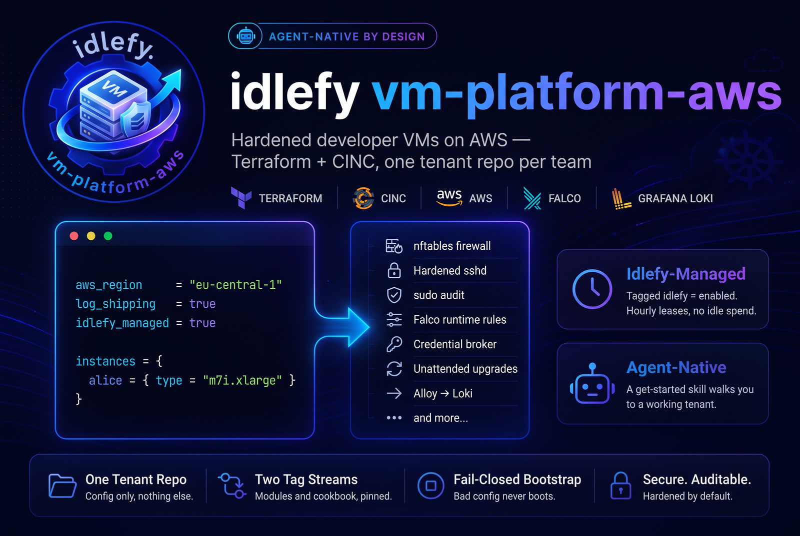

# vm-platform-aws



Hardened developer VMs on AWS — Terraform + CINC, built to be managed by
[Idlefy](https://idlefy.com).

This repository is a **template**. It publishes two artifacts and deploys
nothing itself:

| Artifact | Published as | Consumed by a tenant as |
|---|---|---|
| the CINC cookbook `base` | `base-X.Y.Z` tags | a Policyfile `git:` + `tag:` pin |
| the Terraform modules `ec2` and `fleet-guards`, plus `tenant-skeleton/` | `vX.Y.Z` tags | `?ref=<sha>` on each module `source` |

A **tenant** is a private repository generated from `tenant-skeleton/`. It
holds configuration and nothing else: which regions, which VMs, whose SSH
keys, where the CINC server is. Every VM it creates is tagged
`idlefy = "enabled"` by default, which is how Idlefy finds it and starts and
stops it on the developer's schedule.

## Where to go

- **[Runbook](runbook.md)** — from a fresh tenant repository to a running
  fleet: state bucket, the tenant files, the policyfile, CINC server, first VMs,
  the Grafana Cloud token.
- **[Versioning](versioning.md)** — the two tag streams, what a tenant pins
  where, and how `pin-check` keeps the two honest.
- **Design records** — the reasoning behind the parts that were measured
  rather than assumed:
    - [Sudo audit alerting](design/sudo-audit-alerting.md) — why the
      journal is a tripwire and Falco is the detector.
    - [Log shipping](design/log-shipping.md) — Alloy → Loki, the rate
      limiter, the six Grafana alert rules.
    - [Optional log shipping](design/optional-log-shipping.md) — the
      `log_shipping` switch and what "off" has to mean.
    - [Per-VM AWS access](design/per-vm-aws-access.md) — one IAM identity
      per VM, a boundary derived from bundles, a credential broker in tmpfs.
- **[Changelog](changelog.md)**

## Get started

```bash
git clone https://github.com/idlefy/vm-platform-aws.git
cd vm-platform-aws
claude          # the get-started skill creates your tenant repository
```

Without Claude Code: create a private repository, copy the contents of
`tenant-skeleton/` into its root, run `make prepare PLATFORM_TAG=vX.Y.Z` at the
current release tag, fill in the six tenant files plus the policyfile and the
two Ansible vault files, and `terraform plan`. The
[README](https://github.com/idlefy/vm-platform-aws/blob/main/README.md)
has the full list; the [runbook](runbook.md) takes it from there.

## What a VM gets

Firewall with default-drop inbound, hardened `sshd` with fail2ban, IMDS
blocked for everything but root, rootless Docker, unattended security
upgrades, a `sudo` audit path that a developer cannot silence, Falco at the
syscall layer, a root-owned credential broker that keeps AWS credentials off
disk, Traefik publishing a developer's containers behind Let's Encrypt and basic
auth, and the systemd journal shipped to Grafana Cloud Loki within seconds
(optional per tenant).
The
[cookbook README](https://github.com/idlefy/vm-platform-aws/blob/main/cinc/README.md)
walks through each control.
